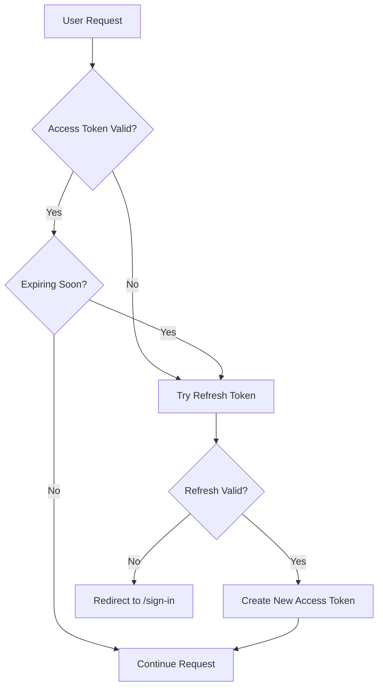

# 🔄 Tổng Kết: Hệ Thống Tự Động Refresh Token

## ✅ Các File Đã Tạo/Sửa

### 1. **src/lib/jwt.ts** ✏️ (Đã sửa)
- ✅ Thêm `isTokenExpiringSoon()` - Kiểm tra token sắp hết hạn
- ✅ Thêm `getTokenTimeRemaining()` - Lấy thời gian còn lại

### 2. **src/middleware.ts** ✏️ (Đã sửa)
- ✅ Tự động refresh token khi không có access token
- ✅ Tự động refresh token khi token không hợp lệ
- ✅ Tự động refresh token khi sắp hết hạn (< 5 phút)
- ✅ Không cần redirect, tự động set cookie mới

### 3. **src/app/api/refresh/route.ts** ✏️ (Đã sửa)
- ✅ Kiểm tra refresh token trong database
- ✅ Kiểm tra token có bị revoke không
- ✅ Kiểm tra token có hết hạn không
- ✅ Trả về access token mới với cookie settings đầy đủ

### 4. **src/lib/fetch-with-refresh.ts** ⭐ (Mới tạo)
- ✅ `fetchWithRefresh()` - Fetch với auto-retry khi 401
- ✅ `fetchJSON()` - Wrapper tiện lợi cho JSON API
- ✅ Tự động redirect về /sign-in nếu refresh thất bại

### 5. **src/hooks/use-token-refresh.ts** ⭐ (Mới tạo)
- ✅ Hook React để tự động refresh định kỳ
- ✅ Mặc định refresh mỗi 10 phút
- ✅ Có thể tùy chỉnh interval

### 6. **src/components/token-refresh-provider.tsx** ⭐ (Mới tạo)
- ✅ Provider component wrap toàn bộ app
- ✅ Tự động kích hoạt refresh định kỳ

### 7. **src/app/layout.tsx** ✏️ (Đã sửa)
- ✅ Tích hợp `TokenRefreshProvider`
- ✅ Tự động refresh cho toàn bộ app

### 8. **TOKEN_REFRESH_GUIDE.md** ⭐ (Mới tạo)
- ✅ Hướng dẫn chi tiết cách hoạt động
- ✅ Ví dụ sử dụng
- ✅ Cấu hình và troubleshooting

### 9. **src/lib/api-examples.ts** ⭐ (Mới tạo)
- ✅ Các ví dụ thực tế về cách sử dụng
- ✅ CRUD operations với auto-refresh
- ✅ Upload file với auto-refresh

## 🎯 Tính Năng Chính

### 1. **Ba Lớp Bảo Vệ**
```
┌─────────────────────────────────────────┐
│  1. Middleware (Server-side)            │
│     • Mỗi lần navigation                │
│     • Tự động refresh nếu cần           │
└─────────────────────────────────────────┘
           ↓
┌─────────────────────────────────────────┐
│  2. Fetch Wrapper (Client-side)         │
│     • Mỗi lần gọi API                   │
│     • Auto-retry nếu gặp 401            │
└─────────────────────────────────────────┘
           ↓
┌─────────────────────────────────────────┐
│  3. Background Refresh (React Hook)     │
│     • Định kỳ mỗi 10 phút               │
│     • Chạy ngầm khi user đang dùng app  │
└─────────────────────────────────────────┘
```

### 2. **Tự Động Hoàn Toàn**
- ❌ Không cần can thiệp thủ công
- ❌ Không cần kiểm tra token trong code
- ✅ Chỉ cần dùng `fetchJSON()` thay vì `fetch()`

### 3. **An Toàn**
- ✅ HttpOnly cookies (không thể đọc từ JavaScript)
- ✅ Kiểm tra database trước khi refresh
- ✅ Kiểm tra revoked status
- ✅ Kiểm tra expiration

## 🚀 Cách Sử Dụng

### Trong Component
```typescript
import { fetchJSON } from "@/lib/fetch-with-refresh";

const documents = await fetchJSON("/api/documents");
// Nếu token hết hạn → tự động refresh → retry → trả về kết quả
```

### Tạo Document
```typescript
import { fetchWithRefresh } from "@/lib/fetch-with-refresh";

const response = await fetchWithRefresh("/api/documents", {
    method: "POST",
    headers: { "Content-Type": "application/json" },
    body: JSON.stringify({ title: "New Doc" })
});
```

### Không Cần Làm Gì Thêm!
Layout đã tự động refresh mỗi 10 phút, middleware tự động refresh khi navigation.

## 📊 Luồng Hoạt Động



## ⚙️ Cấu Hình

### Thay đổi thời gian refresh
```typescript
// Trong layout.tsx hoặc component
<TokenRefreshProvider intervalMinutes={15} />
```

### Thay đổi ngưỡng "sắp hết hạn"
```typescript
// Trong middleware.ts
const expiringSoon = await isTokenExpiringSoon(access, 600); // 10 phút
```

### Thay đổi thời hạn token
```typescript
// Trong các endpoint login/register
const accessToken = await signToken({ id: user.id }, "30m");
const refreshToken = await signToken({ id: user.id }, "14d");
```

## 🎉 Hoàn Thành!

Hệ thống đã sẵn sàng! Không cần thêm bước nào. Frontend sẽ tự động:
1. ✅ Refresh token trước khi hết hạn
2. ✅ Retry request khi gặp 401
3. ✅ Refresh định kỳ khi đang sử dụng
4. ✅ Redirect về login nếu không thể refresh

---
**Lưu ý**: Đảm bảo biến môi trường `JWT_SECRET` đã được set trong `.env` file.
